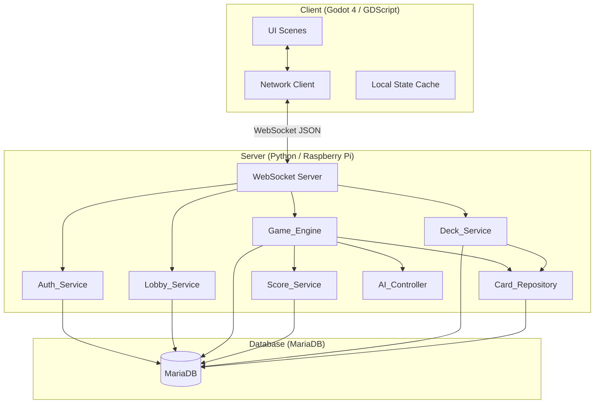

# Design Document

## Overview

This design describes a networked, turn-based card game system for the Tribbles customizable card game. The system is split into two main deployable units:

1. **Server** — A Python application running on a Raspberry Pi, responsible for authentication, game logic, rule enforcement, scoring, and data persistence via MariaDB.
2. **Client** — A Godot 4 / GDScript application for Windows and Linux, providing the player-facing UI including login, deck builder, game lobby, and game table.

Communication between client and server uses a WebSocket-based protocol with JSON message payloads. The server is authoritative: it validates all actions, enforces all card powers, and broadcasts state updates. The client renders state and collects player input.

The game supports 4–8 players per session, with computer-controlled players filling empty seats. All six Tribbles expansions are supported with full power enforcement. The UI is localised in English (default) and Swedish.

---

## Architecture



### Key Architectural Decisions

| Decision | Rationale |
|----------|-----------|
| WebSocket transport | Bidirectional, low-latency communication needed for real-time turn updates and power prompts. HTTP polling would add unnecessary latency. |
| Server-authoritative model | Prevents cheating; all game state lives on the server. Client is a thin view. |
| MariaDB | Meets the requirement for relational persistence; well-supported on Raspberry Pi (ARM). |
| JSON message protocol | Human-readable, easy to debug, well-supported in both Python and GDScript. |
| Stateful game sessions in memory | Game state is held in server memory during play for performance; only persistent data (scores, decks, players) is written to DB. |
| Single-process server with async I/O | A Raspberry Pi has limited resources; an asyncio-based server avoids multi-process overhead while handling concurrent WebSocket connections. |

---

## Components and Interfaces

### Server Components

#### Auth_Service
- **Purpose**: Player registration, login, session token management.
- **Interface**:
  - `register(username, password, email) → Result[PlayerID, Error]`
  - `login(username, password) → Result[SessionToken, Error]`
  - `validate_token(token) → Result[PlayerID, Error]`
  - `invalidate_token(token) → None`

#### Card_Repository
- **Purpose**: Read-only access to the card catalogue.
- **Interface**:
  - `search_cards(filters: CardFilter) → List[Card]`
  - `get_card(card_id) → Card`
  - `get_all_expansions() → List[Expansion]`
- **Note**: `get_all_expansions` returns `Expansion` objects containing `expansion_id`, `expansion_name`, `pack_art_filename`, and `expansion_description`. The expansion name can be resolved from an `expansion_id` via this method.

#### Deck_Service
- **Purpose**: CRUD operations on player decks.
- **Interface**:
  - `save_deck(player_id, deck_data) → DeckID`
  - `load_deck(player_id, deck_id) → Result[Deck, Error]`
  - `copy_deck(player_id, source_deck_id) → Result[DeckID, Error]`
  - `list_decks(player_id) → List[DeckSummary]`
  - `list_public_decks() → List[DeckSummary]`

#### Lobby_Service
- **Purpose**: Game session creation, joining, spectating, and lifecycle management.
- **Interface**:
  - `create_game(player_id, deck_id, player_count) → Result[GameSessionID, Error]`
  - `join_game(player_id, deck_id, session_id) → Result[None, Error]`
  - `start_game(player_id, session_id) → Result[None, Error]`
  - `list_waiting_games() → List[GameSessionSummary]`
  - `list_active_games() → List[GameSessionSummary]`
  - `watch_game(player_id, session_id) → Result[None, Error]`
- **Note**: `list_waiting_games` returns sessions available to join; `list_active_games` returns sessions available to watch. Together they populate the lobby's two-category game list.
- **Validation**: `create_game` and `join_game` validate that the referenced deck has a total card count (sum of all card quantities) ≥ 35 before proceeding. Decks below this threshold are rejected with an error indicating the deck does not meet the minimum card count for game use.

#### Game_Engine
- **Purpose**: Core game logic, rule enforcement, turn management, power resolution.
- **Interface**:
  - `initialise_game(session: GameSession) → GameState`
  - `process_action(game_id, player_id, action: PlayerAction) → Result[List[GameEvent], Error]`
  - `get_visible_state(game_id, player_id) → PlayerVisibleState`
  - `get_spectator_visible_state(game_id) → SpectatorVisibleState`
- **Note**: `get_spectator_visible_state` returns all public game state (play piles, discard piles, draw deck card counts, scores, current sequence, direction, active player) without any player's hand contents.
- **Sub-components**:
  - `PowerResolver` — Dispatches and executes card power effects.
  - `TurnManager` — Tracks active player, direction, sequence.
  - `RoundManager` — Handles end-of-round, scoring trigger, new-round setup.

#### Score_Service
- **Purpose**: Score calculation including special scoring (Bonus, Quadruple, IDIC, Tally).
- **Interface**:
  - `calculate_round_scores(game_state) → Dict[PlayerID, int]`
  - `apply_immediate_score(game_id, player_id, points) → None`

#### AI_Controller
- **Purpose**: Decision-making for computer-controlled players and AI_Substitute behaviour for disconnected players.
- **Interface**:
  - `choose_action(game_state, player_id) → PlayerAction`
- **Note**: The same strategy is used for both permanently computer-controlled seats and AI_Substitute seats (disconnected players after timeout). The AI_Controller operates on the disconnected player's existing hand, draw deck, play pile, and discard pile without modification.

### Client Components

#### Network Client (Autoload singleton)
- Manages WebSocket connection, message serialisation/deserialisation, reconnection.

#### UI Scenes
- `LoginScreen` — Server address, username, password entry with login/registration mode toggle.
- `MainMenu` — Navigation to deck builder, lobby, settings.
- `DeckBuilder` — Card search, deck editing, save/load/copy.
- `LobbyScreen` — Two-category game list: waiting/joinable sessions and active/watchable sessions. Actions: Create Game, Join Game, Watch Game.
- `GameTable` — Virtual table, hand display, action buttons, score overlay.
- `SpectatorView` — Read-only game table showing all public information (play piles, discard piles, draw deck counts, scores, sequence, direction, active player) without hand contents. No action buttons.
- `EndOfRoundScreen` — Score summary popup.
- `EndOfGameScreen` — Final rankings.
- `SettingsScreen` — Language selection.

#### Localisation
- All UI strings stored in Godot's built-in translation system (CSV or PO files).
- Keys referenced in scenes; runtime locale switch triggers re-render.

---

## Data Models

### Database Schema (MariaDB)

```sql
CREATE TABLE players (
    player_id INT AUTO_INCREMENT PRIMARY KEY,
    username VARCHAR(64) NOT NULL UNIQUE,
    password_hash VARCHAR(255) NOT NULL,
    email VARCHAR(255) NOT NULL,
    created_at TIMESTAMP DEFAULT CURRENT_TIMESTAMP
);

CREATE TABLE sessions (
    token VARCHAR(128) PRIMARY KEY,
    player_id INT NOT NULL,
    created_at TIMESTAMP DEFAULT CURRENT_TIMESTAMP,
    expires_at TIMESTAMP NOT NULL,
    FOREIGN KEY (player_id) REFERENCES players(player_id)
);

CREATE TABLE expansions (
    expansion_id INT AUTO_INCREMENT PRIMARY KEY,
    expansion_name VARCHAR(128) NOT NULL UNIQUE,
    pack_art_filename VARCHAR(255) NOT NULL,
    expansion_description TEXT
);

CREATE TABLE cards (
    card_id INT AUTO_INCREMENT PRIMARY KEY,
    card_name VARCHAR(128) NOT NULL,
    denomination INT NOT NULL,
    power_text VARCHAR(255) NOT NULL,
    card_number VARCHAR(32) NOT NULL,
    expansion_id INT NOT NULL,
    image_filename VARCHAR(255) NOT NULL,
    FOREIGN KEY (expansion_id) REFERENCES expansions(expansion_id)
);

CREATE TABLE decks (
    deck_id INT AUTO_INCREMENT PRIMARY KEY,
    owner_player_id INT NOT NULL,
    deck_name VARCHAR(128) NOT NULL,
    is_public BOOLEAN DEFAULT FALSE,
    comment_text TEXT,
    FOREIGN KEY (owner_player_id) REFERENCES players(player_id)
);

CREATE TABLE deck_cards (
    deck_id INT NOT NULL,
    card_id INT NOT NULL,
    quantity INT NOT NULL DEFAULT 1,
    PRIMARY KEY (deck_id, card_id),
    FOREIGN KEY (deck_id) REFERENCES decks(deck_id) ON DELETE CASCADE,
    FOREIGN KEY (card_id) REFERENCES cards(card_id)
);
```

### In-Memory Game State (Python dataclasses)

```python
@dataclass
class CardInstance:
    card_id: int
    card_name: str
    denomination: int
    power_text: str
    expansion_id: int

@dataclass
class PlayerState:
    player_id: int
    username: str
    is_computer: bool
    hand: List[CardInstance]
    draw_deck: List[CardInstance]
    play_pile: List[CardInstance]
    discard_pile: List[CardInstance]
    cumulative_score: int
    is_decked: bool
    has_gone_out: bool
    seat_position: int
    # Transient state for power effects
    score_target_by: Optional[int]  # player_id who used Score on this player
    borrowed_cards: List[Tuple[CardInstance, int]]  # (card, original_owner_id)
    time_warp_reductions: Set[int]  # denominations of Time Warp cards in play pile

@dataclass
class GameState:
    game_id: str
    players: List[PlayerState]  # ordered by seat position
    spectators: List[int]  # list of player_ids watching the game
    current_player_index: int
    direction: int  # 1 = clockwise, -1 = counterclockwise
    current_sequence: int  # current expected denomination
    last_played_denomination: Optional[int]
    sequence_broken: bool  # True after a pass
    round_number: int
    frozen_powers: Dict[str, int]  # power_name → expires_at_player_index
    game_status: str  # "active", "round_end", "completed"
    reconnection_timeout: int  # seconds; default 30, configurable per session

@dataclass
class DisconnectionState:
    """Tracks disconnection status for a player within a game session."""
    player_id: int
    is_disconnected: bool  # True when connection lost, False when reconnected
    disconnected_at: Optional[float]  # server timestamp when disconnection detected
    ai_substitute_active: bool  # True after reconnection_timeout elapses without reconnect
```

### WebSocket Message Protocol

Messages are JSON objects with a `type` field and a `payload` field.

**Client → Server (Actions)**:
```json
{"type": "register", "payload": {"username": "...", "password": "...", "email": "..."}}
{"type": "login", "payload": {"username": "...", "password": "..."}}
{"type": "play_card", "payload": {"card_id": 42, "activate_power": true}}
{"type": "draw_card", "payload": {}}
{"type": "power_choice", "payload": {"choice_type": "target_player", "value": 3}}
{"type": "accept_draw", "payload": {}}
{"type": "create_game", "payload": {"deck_id": 5, "player_count": 6}}
{"type": "join_game", "payload": {"session_id": "abc123", "deck_id": 5}}
{"type": "start_game", "payload": {"session_id": "abc123"}}
{"type": "watch_game", "payload": {"session_id": "abc123"}}
{"type": "leave_spectate", "payload": {"session_id": "abc123"}}
```

**Client → Server (Reconnection)**:
```json
{"type": "reconnect", "payload": {"session_id": "abc123"}}
```

**Server → Client (Events)**:
```json
{"type": "game_state_update", "payload": {"visible_state": {...}}}
{"type": "prompt", "payload": {"prompt_type": "activate_power", "card": {...}, "options": [...]}}
{"type": "round_end", "payload": {"scores": {...}}}
{"type": "game_end", "payload": {"final_scores": {...}, "winner": "..."}}
{"type": "error", "payload": {"code": "...", "message": "..."}}
{"type": "disconnect_notify", "payload": {"player_id": 3, "username": "...", "grace_period_seconds": 30}}
{"type": "reconnect_notify", "payload": {"player_id": 3, "username": "..."}}
{"type": "reconnect_state_sync", "payload": {"hand": [...], "play_pile": [...], "draw_deck_count": 12, "discard_pile": [...], "scores": {...}, "current_sequence": 100, "direction": 1, "active_player_id": 5, "round_number": 2, "game_status": "active"}}
{"type": "spectator_state_update", "payload": {"play_piles": {...}, "discard_piles": {...}, "draw_deck_counts": {...}, "scores": {...}, "current_sequence": 100, "direction": 1, "active_player_id": 5, "round_number": 2, "game_status": "active"}}
{"type": "spectator_count_update", "payload": {"session_id": "abc123", "spectator_count": 3}}
```

---

## Correctness Properties

*A property is a characteristic or behavior that should hold true across all valid executions of a system — essentially, a formal statement about what the system should do. Properties serve as the bridge between human-readable specifications and machine-verifiable correctness guarantees.*

### Property 1: Registration and login round-trip

*For any* valid username, password, and email combination where the username is not already taken, registering then logging in with the same username and password should return a valid session token; and registering a second time with the same username should return a "username taken" error.

**Validates: Requirements 1.2, 1.3, 1.4**

### Property 2: Invalid login does not reveal which field is wrong

*For any* login attempt with either an invalid username or an incorrect password, the Auth_Service should return the same error response format without distinguishing which field caused the failure.

**Validates: Requirements 1.5**

### Property 3: Invalidated token is rejected

*For any* valid session token that has been invalidated, all subsequent requests using that token should be rejected with an unauthorised error.

**Validates: Requirements 1.6**

### Property 4: Card search filter correctness

*For any* combination of filter parameters (denomination, power name, expansion, card name substring), all cards returned by the Card_Repository should satisfy every supplied filter criterion, and no card satisfying all criteria should be omitted.

**Validates: Requirements 2.3**

### Property 5: Compound powers are distinct from component powers

*For any* compound power (e.g., "Clone & Reverse"), searching for that compound power should not return cards with only one of the component powers, and searching for a component power should not return cards whose power is the compound.

**Validates: Requirements 2.5**

### Property 6: Deck save/load round-trip

*For any* valid deck data (name, public flag, comment, card entries with quantities), saving the deck and then loading it should return deck data equivalent to the original.

**Validates: Requirements 3.2, 3.3**

### Property 7: Public deck access

*For any* deck marked as public and any authenticated player, loading that deck should succeed and return the full deck data.

**Validates: Requirements 3.4**

### Property 8: Deck copy produces identical card entries

*For any* deck that is either owned by the requesting player or marked public, copying it should produce a new deck with a different ID but identical card entries and quantities.

**Validates: Requirements 3.5, 3.6**

### Property 9: Private deck copy denied for non-owner

*For any* deck marked as private and any player who is not the owner, attempting to copy that deck should return an authorisation error.

**Validates: Requirements 3.7**

### Property 10: Game session creation with valid player count

*For any* player count between 4 and 8 inclusive and a valid deck ID, creating a game session should succeed and produce a session in the waiting state with the specified player count.

**Validates: Requirements 4.1**

### Property 11: Join game adds player when session is waiting and not full

*For any* game session in the waiting state with fewer human players than the total player count, a join request from a new player with a valid deck should succeed and increment the human player count by one.

**Validates: Requirements 4.2**

### Property 12: Join game rejected for non-waiting or full session

*For any* game session that is either not in the waiting state or already at full human capacity, a join request should return an appropriate error.

**Validates: Requirements 4.3, 4.4**

### Property 13: Start game fills remaining seats with AI

*For any* game session with N human players joined (where N ≤ total player count), starting the game should add exactly (total - N) computer-controlled players and transition the session to active state.

**Validates: Requirements 4.6**

### Property 14: AI actions are always valid

*For any* game state where it is a computer player's turn, the action chosen by the AI_Controller should be a valid action according to the current game rules.

**Validates: Requirements 4.7**

### Property 15: Game initialisation invariants

*For any* set of players entering a game, after initialisation: all players should have unique seat positions covering positions 1 through player count, the starting player should be a member of the player list, and every player should have exactly 7 cards in hand.

**Validates: Requirements 5.1, 5.2, 5.4**

### Property 16: Turn validity — play or draw

*For any* game state where it is a player's turn, the Game_Engine should accept only: (a) playing a card whose denomination matches the current sequence, (b) playing a 1-denomination card if the sequence was broken, (c) playing a Clone card matching the last played denomination, or (d) drawing a card. All other actions should be rejected.

**Validates: Requirements 6.1, 6.7, 9.8**

### Property 17: Playing a card advances sequence correctly

*For any* valid card play, the card should move from the player's hand to their play pile, and the sequence should advance to the next denomination in the cycle (1→10→100→1000→10000→100000→1).

**Validates: Requirements 6.2, 6.3**

### Property 18: Drawing a card moves top of draw deck to hand

*For any* draw action, the top card of the player's draw deck should move to the player's hand, and if it does not match the current sequence denomination, a pass should be recorded.

**Validates: Requirements 6.4, 6.6**

### Property 19: Drawn matching card offers play-or-keep choice

*For any* drawn card whose denomination matches the current sequence, the player should be offered the choice to play it immediately or keep it in hand; both choices should be valid.

**Validates: Requirements 6.5**

### Property 20: Empty draw deck causes decked state

*For any* player who must draw a card and whose draw deck is empty, that player should be marked as decked.

**Validates: Requirements 6.8**

### Property 21: Last played denomination tracked independently

*For any* card play, the last_played_denomination should equal that card's denomination, independent of the current sequence state.

**Validates: Requirements 6.9**

### Property 22: Decked state invariants

*For any* player who becomes decked: their hand should be immediately emptied (moved to discard pile), they should not be able to score points nor have points scored from them (except via Antidote), and their play pile should remain unchanged for the duration of the round.

**Validates: Requirements 7.1, 7.2, 7.3**

### Property 23: Decked player is valid power target

*For any* decked player, they should remain a valid target for Tribbles powers.

**Validates: Requirements 7.4**

### Property 24: Last non-decked player goes out

*For any* game state where all players except one are decked, the remaining player should immediately go out by placing their entire hand into their play pile.

**Validates: Requirements 7.5**

### Property 25: Decked player round transition

*For any* decked player at round end: if their play pile has 7 or more cards, it should become their shuffled draw deck for the next round; if fewer than 7 cards, they should sit out the next round.

**Validates: Requirements 7.6, 7.7**

### Property 26: End-of-round scoring and cleanup

*For any* round end: each player who went out should score points equal to the sum of denominations in their play pile; each player who did not go out should have their hand moved to their discard pile; and all players' play piles should be shuffled into their draw decks.

**Validates: Requirements 8.1, 8.2, 8.3, 8.4**

### Property 27: New round starting player selection

*For any* round end where exactly one player went out, that player should be the starting player for the next round. When multiple players went out simultaneously, the one with the lowest round score should start.

**Validates: Requirements 8.7, 8.8**

### Property 28: Power activation choice

*For any* card with an activatable power, when played the player should be prompted to activate or decline; declining should place the card without triggering its effect.

**Validates: Requirements 9.1**

### Property 29: Discard power effect

*For any* Discard power activation and any card chosen from hand, that card should move from the player's hand to their discard pile, and hand size should decrease by one.

**Validates: Requirements 9.2**

### Property 30: Go power grants additional turn

*For any* Go power activation, the active player should remain the active player for the next action with the sequence advanced.

**Validates: Requirements 9.3**

### Property 31: Skip power skips next player

*For any* Skip power activation, the next player in the current direction should be skipped and the turn should pass to the player after them.

**Validates: Requirements 9.4**

### Property 32: Poison power scores from opponent's draw deck

*For any* Poison power activation targeting a player with at least one card in their draw deck, the top card of that player's draw deck should be discarded and the active player should gain points equal to that card's denomination.

**Validates: Requirements 9.5**

### Property 33: Rescue power recovers from discard pile

*For any* Rescue power activation and any card chosen from the player's discard pile, that card should either be placed face-down on top of the draw deck, or if its denomination matches the current sequence, be playable immediately.

**Validates: Requirements 9.6**

### Property 34: Reverse power toggles direction (idempotent pair)

*For any* game state, activating Reverse should toggle the direction; activating Reverse twice should restore the original direction.

**Validates: Requirements 9.7**

### Property 35: Bonus scoring condition

*For any* player who was not decked and whose play pile contains Bonus cards at denominations 1, 10, 100, and 1000, the Score_Service should add 100000 bonus points. For any play pile missing one or more of these, no bonus should be awarded.

**Validates: Requirements 10.1**

### Property 36: Antidote reverses Poison scoring

*For any* Poison targeting a player whose top draw deck card has the Antidote power, the targeted player should score points equal to that card's denomination (instead of the Poison player), and should be allowed to place their hand beneath their draw deck.

**Validates: Requirements 11.1**

### Property 37: Copy power applies target's top play pile card effect

*For any* Copy power activation targeting another player's play pile, the effect should be identical to activating the power of the top card of that pile (subject to that power's rules), except Quadruple cannot be copied.

**Validates: Requirements 11.2, 12.10**

### Property 38: Cycle preserves hand size

*For any* Cycle power activation, the player's hand size should remain unchanged (one card placed under draw deck, one card drawn from top).

**Validates: Requirements 11.3**

### Property 39: Draw power increases target's hand

*For any* Draw power activation targeting a player with cards in their draw deck, that player's hand should grow by 1 and their draw deck should shrink by 1.

**Validates: Requirements 11.4**

### Property 40: Exchange swaps hand card with discard card

*For any* Exchange power activation, the player's hand size should remain unchanged, the discarded card should appear in the discard pile, and the taken card should appear in hand.

**Validates: Requirements 11.5**

### Property 41: Kill removes top of target's play pile

*For any* Kill power activation targeting a player with cards in their play pile, the top card should move from their play pile to their discard pile.

**Validates: Requirements 11.6**

### Property 42: Recycle merges discard into draw deck

*For any* Recycle power activation targeting a player, that player's discard pile should become empty and all former discard cards should be in their draw deck.

**Validates: Requirements 11.7**

### Property 43: Score power delayed scoring

*For any* Score power activation targeting a player, if that player plays a card on their next turn, the Score activator should gain points equal to that card's denomination.

**Validates: Requirements 11.9**

### Property 44: Compound power activation rules

*For any* compound power card: if neither component is Clone, both powers must activate together; if one component is Clone and Clone is not used, only the non-Clone power activates; if Clone is used, both powers must activate.

**Validates: Requirements 12.1, 12.2, 12.3**

### Property 45: Battle resolution

*For any* Battle power activation, both players reveal top 3 cards of their draw decks; the player with the higher total denomination places those 6 cards under their play pile, the other discards their 3 revealed cards.

**Validates: Requirements 12.4**

### Property 46: Evolve preserves hand count

*For any* Evolve power activation, the player's hand size should remain the same (old hand moved to discard, same count drawn from deck).

**Validates: Requirements 12.5**

### Property 47: Freeze prevents playing named power

*For any* Freeze power activation naming a specific power, any attempt to play a card with that power during the freeze period should be rejected by the Game_Engine.

**Validates: Requirements 12.6**

### Property 48: Mutate preserves play pile count

*For any* Mutate power activation, the player's play pile size should remain the same (old pile shuffled into deck, same count moved from deck to pile).

**Validates: Requirements 12.7**

### Property 49: Process net hand gain

*For any* Process power activation, the player's hand should grow by 1 net card (draw 3, place 2 under draw deck).

**Validates: Requirements 12.8**

### Property 50: Quadruple scoring modifier

*For any* round winner whose play pile contains the Quadruple card, that card should contribute 40000 points to their score instead of 10000.

**Validates: Requirements 12.9**

### Property 51: Safety end-of-round modifier

*For any* player with Safety in their play pile at round end who did not go out, their hand should be shuffled into their draw deck instead of being placed in their discard pile.

**Validates: Requirements 12.11**

### Property 52: Tally scoring split

*For any* scoring event involving a card with the Tally power, the scorer should receive half the card's denomination value and the Tally card's owner should receive an equal number of points.

**Validates: Requirements 12.12**

### Property 53: Toxin reveals cards per Discard count

*For any* Toxin power activation, each opponent should reveal a number of cards from their draw deck equal to the number of Discard cards in their play pile; the active player scores points equal to one chosen revealed card's denomination; all revealed cards go to their respective owners' hands.

**Validates: Requirements 12.13**

### Property 54: Avalanche conditional discard

*For any* Avalanche power activation where the active player has at least 4 other cards in hand after playing, all players' hands should decrease by 1 card (to discard), and the active player should discard one additional card.

**Validates: Requirements 13.1**

### Property 55: Famine resets sequence to 1

*For any* Famine power activation, the next expected sequence denomination should be 1 regardless of the current sequence position.

**Validates: Requirements 13.2**

### Property 56: Stampede allows all to play, only active power triggers

*For any* Stampede power activation, all players who play a card of the current sequence denomination should have it placed on their play pile, but only the active player's card power should be eligible for activation.

**Validates: Requirements 13.3**

### Property 57: Time Warp reduces next round hand size

*For any* player with Time Warp cards in their play pile who did not go out, they should receive fewer cards at the start of the next round (reduced by the number of unique Time Warp denominations in their pile, minimum 1 card dealt).

**Validates: Requirements 13.4**

### Property 58: Advance playable after sequence break

*For any* game state where the sequence was broken by a pass, an Advance card should be playable in place of a 1-denomination card.

**Validates: Requirements 14.1**

### Property 59: Assimilate borrows and returns

*For any* Assimilate power activation, the top card of the target's draw deck should appear in the active player's play pile; at round end, that card should return to the original owner.

**Validates: Requirements 14.2**

### Property 60: Convert transforms card placement

*For any* Convert power activation, the Convert card should be placed beneath the active player's draw deck, and the former top card of the draw deck should be placed on top of the active player's play pile.

**Validates: Requirements 14.3**

### Property 61: IDIC scoring calculation

*For any* player who goes out with IDIC cards in their play pile, they should score 10000 points per unique power in their play pile, for each IDIC card of a distinct denomination (not cumulative for same-denomination IDIC cards).

**Validates: Requirements 14.4**

### Property 62: Masaka replaces all hands with 3 cards

*For any* Masaka power activation, all players should have exactly 3 cards in hand afterward, and their former hands should be beneath their respective draw decks.

**Validates: Requirements 14.5**

### Property 63: Scan preserves draw deck size

*For any* Scan power activation, the draw deck size should remain unchanged, and the top 3 cards should end up either on top or bottom of the draw deck in the player's chosen order.

**Validates: Requirements 14.6**

### Property 64: Utilize forces opponent card to play pile and scores

*For any* Utilize power activation targeting an opponent with at least 2 cards in hand, the target's hand should shrink by 1, their play pile should grow by 1, and the active player should gain points equal to the placed card's denomination.

**Validates: Requirements 14.7**

### Property 65: Game ends after five rounds

*For any* game, after the 5th round completes, the game should transition to the completed state and the player with the highest cumulative score should be declared the winner.

**Validates: Requirements 16.1, 16.2**

### Property 66: Disconnection marks player and starts grace period

*For any* active game state and any connected player, when a disconnection event is detected, the Game_Engine should mark that player as disconnected with a timestamp and begin a grace period equal to the session's configured Reconnection_Timeout value.

**Validates: Requirements 21.1**

### Property 67: Disconnected player's turn is skipped without decking

*For any* game state where it is a disconnected player's turn and the Reconnection_Timeout has not elapsed, the Game_Engine should skip that player's turn (advancing to the next player) without marking the disconnected player as decked.

**Validates: Requirements 21.3**

### Property 68: AI_Substitute activation preserves player state

*For any* disconnected player whose Reconnection_Timeout has elapsed, the Game_Engine should activate an AI_Substitute that uses the same AI_Controller strategy as computer-controlled players, operating on the disconnected player's existing hand, draw deck, play pile, and discard pile without modification.

**Validates: Requirements 21.4, 21.5**

### Property 69: Reconnection restores player control with full state sync

*For any* game state with an AI_Substitute active for a disconnected player, when that player reconnects with a valid session token, the AI_Substitute should be immediately removed, full control restored to the player, and a state sync message sent containing hand contents, all visible piles, scores, current sequence denomination, play direction, and active player.

**Validates: Requirements 21.6, 21.7**

### Property 70: Game ending with disconnected player records score in results

*For any* game that reaches the completed state while a player is disconnected, that player's final score should be recorded and the player should appear in the end-of-game results; the results should be retrievable when the player later reconnects.

**Validates: Requirements 21.8**

### Property 71: Deck size enforcement at game creation and joining

*For any* deck with a total card count (sum of all card quantities) less than 35, both `create_game` and `join_game` should reject the request with an error. *For any* deck with a total card count greater than or equal to 35, the deck should be accepted by `create_game` and `join_game` (assuming all other parameters are valid).

**Validates: Requirements 4.9, 4.10**

### Property 72: Spectator receives only public state

*For any* game session with one or more spectators, the state updates sent to a spectator should include play piles, discard piles, draw deck card counts, scores, current sequence denomination, play direction, and active player, but should never include any player's hand contents.

**Validates: Requirements 22.2, 22.3**

### Property 73: Spectator cannot perform game actions

*For any* game session and any player who is a spectator of that session, any attempt by that player to perform a game action (playing a card, drawing a card, or activating a power) should be rejected by the Game_Engine with an error.

**Validates: Requirements 22.7**

### Property 74: Spectator leaving does not affect game state

*For any* game session with one or more spectators, when a spectator leaves the session, the game state (players, current player, direction, sequence, scores, piles) should remain identical to the state immediately before the spectator left.

**Validates: Requirements 22.5**


---

## Error Handling

### Server-Side Error Strategy

| Error Category | Handling Approach |
|----------------|-------------------|
| Authentication failures | Return generic "invalid credentials" without leaking which field failed. Log attempt with IP for rate-limiting. |
| Authorisation failures | Return 403-equivalent error with reason code. Do not expose internal state. |
| Invalid game actions | Return error with action rejection reason (e.g., "not your turn", "invalid card for current sequence"). Game state remains unchanged. |
| WebSocket disconnection | Mark player as disconnected; begin Reconnection_Timeout grace period (default 30 seconds, configurable per session). During grace period, skip the player's turn. If timeout expires without reconnection, activate AI_Substitute using the same AI_Controller strategy. On reconnection, immediately restore player control and send full state sync. |
| Database errors | Retry transient failures (deadlocks, connection drops) up to 3 times. Return 500-equivalent error to client on persistent failure. |
| Malformed messages | Log and discard. Return error with "invalid message format" code. |
| Deck validation failures | When `create_game` or `join_game` references a deck with total card count < 35, return error with "deck below minimum card count" code. Game state remains unchanged. Client should prevent selection of under-sized decks, but server enforces as the authoritative check. |
| Concurrent state modification | Use optimistic locking on game state. Reject stale actions with "state changed" error, prompting client to refresh. |

### Client-Side Error Strategy

| Error Category | Handling Approach |
|----------------|-------------------|
| Connection lost | Display reconnection overlay. Attempt reconnection with exponential backoff. |
| Server error responses | Display localised error message to player. Do not crash. |
| Invalid server state | Log warning. Request full state refresh from server. |
| Timeout waiting for server | Display "waiting for server" indicator after 5 seconds. Allow cancel after 30 seconds. |

### Power Resolution Errors

Card powers can create complex interactions. The Game_Engine handles edge cases:

- **Power targeting a decked player**: Allowed (per requirement 7.4), but scoring effects are suppressed.
- **Power targeting empty pile/deck**: Return error "no valid target" and allow player to choose a different target or cancel.
- **Frozen power played**: Reject the card play entirely; card remains in hand.
- **Copy targeting Quadruple**: Reject the copy; allow player to choose a different target.
- **Insufficient cards for power** (e.g., Process with < 3 in draw deck): Execute with available cards; draw as many as possible.

---

## Testing Strategy

### Overview

The testing strategy uses a dual approach:
- **Property-based tests** for universal game logic correctness (server-side, Python/pytest with Hypothesis)
- **Unit tests** for specific examples, edge cases, and integration points
- **Integration tests** for database operations and WebSocket communication
- **Client tests** for UI interactions using GUT (Godot Unit Test framework)

### Property-Based Testing (Server — Python with Hypothesis)

The server's game logic is highly suitable for property-based testing because:
- The Game_Engine is a pure state machine with clear input/output behavior
- Card powers have universal rules that should hold across all valid game states
- Scoring calculations are pure functions of play pile contents
- The input space (game states × player actions) is enormous

**Library**: [Hypothesis](https://hypothesis.readthedocs.io/) for Python

**Configuration**:
- Minimum 100 examples per property test
- Custom strategies for generating valid game states, player hands, and card combinations
- Each test tagged with its design property reference

**Tag format**: `# Feature: tribbles-multiplayer-game, Property {number}: {property_text}`

**Key generators needed**:
- `valid_game_state()` — Generates a random but internally consistent GameState
- `valid_hand(min_cards, max_cards)` — Generates a random hand of cards
- `valid_play_pile()` — Generates a random play pile
- `valid_deck_data()` — Generates random deck save data
- `valid_credentials()` — Generates random valid username/password/email
- `card_with_power(power_name)` — Generates a card with a specific power
- `compound_power_card()` — Generates a compound power card
- `disconnected_game_state()` — Generates a valid game state with one or more players in disconnected/AI_Substitute state

**Property test groupings**:
1. **Auth properties** (Properties 1–3): Registration/login round-trips, token lifecycle
2. **Card catalogue properties** (Properties 4–5): Filter correctness, compound power identity
3. **Deck management properties** (Properties 6–9): Save/load round-trip, access control
4. **Lobby properties** (Properties 10–14): Session lifecycle, AI filling, action validity
5. **Game initialisation properties** (Property 15): Setup invariants
6. **Turn mechanics properties** (Properties 16–21): Action validity, sequence advancement, draw mechanics
7. **Decked state properties** (Properties 22–25): State invariants, round transitions
8. **Scoring properties** (Properties 26–27, 35, 50–53, 61): Round scoring, bonus conditions, modifiers
9. **Base power properties** (Properties 28–34): Individual power effects
10. **Expansion power properties** (Properties 36–64): All expansion power effects
11. **Game lifecycle properties** (Property 65): End-of-game conditions
12. **Disconnection/reconnection properties** (Properties 66–70): Grace period, AI_Substitute, state sync
13. **Spectator properties** (Properties 72–74): Public-only state, action rejection, leave invariance

### Unit Tests (Server — pytest)

Unit tests cover:
- Specific card interaction scenarios (e.g., Poison hitting Antidote with Tally in play)
- Edge cases: empty draw deck during Process, Battle with fewer than 3 cards
- Scoring edge cases: multiple IDIC cards, Quadruple + Bonus in same pile
- Error response format validation
- Database query correctness with known test data

### Integration Tests (Server — pytest)

Integration tests cover:
- Full WebSocket message round-trips
- Database persistence and retrieval
- Multi-player game session lifecycle from creation to completion
- Reconnection handling
- Concurrent player actions

### Client Tests (Godot — GUT)

Client tests cover:
- UI scene instantiation and element presence
- Deck builder: add/remove cards, quantity changes, save/load flow
- Game table: card display, turn highlighting, score updates
- Localisation: all strings render in both English and Swedish
- Network client: message serialisation/deserialisation

### Test Execution

```bash
# Server property-based and unit tests
cd server
pytest --hypothesis-seed=random -v

# Server integration tests (requires running MariaDB)
pytest tests/integration/ -v

# Client tests (requires Godot CLI)
godot --headless -s addons/gut/gut_cmdln.gd
```
